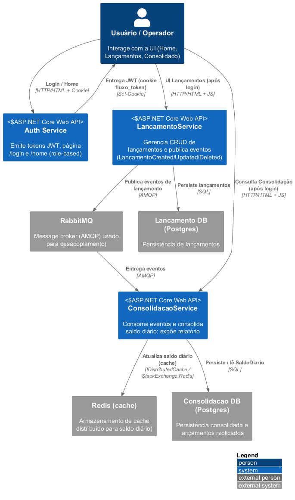
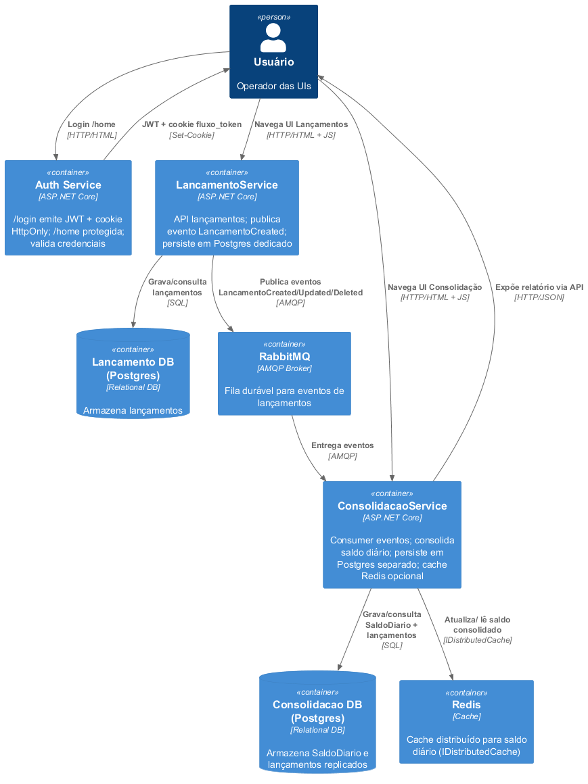

# Desafio CI&T - Solução de Fluxo de Caixa Diário


## Requisitos Funcionais
| Código | Descrição | Implementado (Resumo) |
|--------|-----------|------------------------|
| RF-01 | Registrar lançamentos (débito/crédito) com valor, data, descrição | API CRUD em `LancamentoService` + tipo Crédito/Débito + evento `LancamentoCreated` |
| RF-02 | Persistir lançamentos | Postgres dedicado (`lancamento_db`) via EF Core migrations |
| RF-03 | Consultar histórico de lançamentos | Endpoint `GET /api/FluxoDeCaixa` lista fluxos e lançamentos relacionados |
| RF-04 | Consolidar saldo diário | Consumer no `ConsolidacaoService` atualiza `SaldoDiario` idempotente ao receber evento |
| RF-05 | Relatório consolidado diário | Endpoint `GET /api/SaldoDiario?data=YYYY-MM-DD` + UI estática |
| RF-06 | Autenticação centralizada | Serviço Auth (login, token JWT HS256 + cookie HttpOnly) usado pelos demais serviços |

## Requisitos Não Funcionais
| Código | Descrição | Implementado (Resumo) |
|--------|-----------|-----------------------|
| RNF-01 | Resiliência | Retry DB migrations & RabbitMQ, fanout exchange, containers separados de banco |
| RNF-02 | Escalabilidade | Serviços stateless, mensagens desacopladas, bancos isolados por serviço |
| RNF-03 | Confiabilidade | Idempotência no handler (checa existência de lançamento), filas duráveis |
| RNF-04 | Segurança | Auth central (JWT + cookie)|
| RNF-05 | Manutenibilidade | Código separado por serviço, migrations versionadas, documentação C4 |
| RNF-06 | Observabilidade inicial | Logs console, healthchecks e mensagens de retry no startup |
| RNF-07 | Desempenho | Índices em datas e chave composta, cache Redis (escrita) preparado |
| RNF-08 | Infraestrutura & Deploy | Docker Compose, Postgres segregado (`postgres_lancamento` / `postgres_consolidacao`), variáveis de retry |

## Visão Técnica Sintética
- Serviços: Auth, LancamentoService, ConsolidacaoService
- Mensageria: RabbitMQ (exchange fanout `lancamentos`)
- Bancos: Postgres (2 containers, um por serviço)
- Cache: Redis (saldo diário)
- Auth: JWT HS256 + Cookie HttpOnly
- Containerização: Docker Compose (healthchecks, dependências ordenadas)

## Arquitetura (C4)
Visão resumida em três níveis usando C4:

### Contexto


### Containers


## Execução Rápida
```powershell
docker compose up -d --build
```
UIs/APIs:
- Auth: http://localhost:5080/login
- Lançamentos: http://localhost:5007/
- Consolidação: http://localhost:5260/
- RabbitMQ: http://localhost:15672

## Reset de Dados
```powershell
docker compose down -v
docker compose up -d --build
```

## Estrutura de Eventos
- Evento publicado: `LancamentoCreated` (extensível para Updated/Deleted)
- Exchange: `lancamentos` (fanout)
- Fila consumer: `lancamentos_consolidacao`

## Modelo de Dados (Essencial)
`Lancamento`: Id, FluxoDeCaixaId, Valor, Tipo (0 crédito / 1 débito), Data (UTC), Descricao
`SaldoDiario`: Data (PK), SaldoTotal

## k6 

1) Executar (um único passo):

```powershell
# a partir da raiz do repositório (independente do caminho local)
.\k6\run-load-tests.ps1
```

O comando acima inicia o cenário de teste definido nos scripts em `k6/`.

O que será testado
- `k6/script.js`: faz chamadas concorrentes ao endpoint `GET /api/SaldoDiario?data=YYYY-MM-DD` (padrão: data de hoje). Ele obtém um token de `Auth` no setup e valida respostas 200; configuração padrão: 10 VUs por 30s.
- `k6/create_lancamentos.js` (opcional): cria lançamentos via `POST /api/FluxoDeCaixa/{fluxoId}/lancamentos` para exercitar o caminho de escrita (configuração: 5 VUs por 30s).

Como ler os resultados
- Resumo no console: ao final do k6 você verá métricas principais (VUs, requisições, erros, `http_req_duration` com percentis p(90)/p(95)/p(99)). Esse resumo geralmente atende para verificar performance e regressões.
- JSON detalhado (se gerado): o script pode salvar um resumo em `k6/k6-summary.json`. Para abrir:

```powershell
Get-Content .\k6\k6-summary.json | ConvertFrom-Json | Format-List
```


