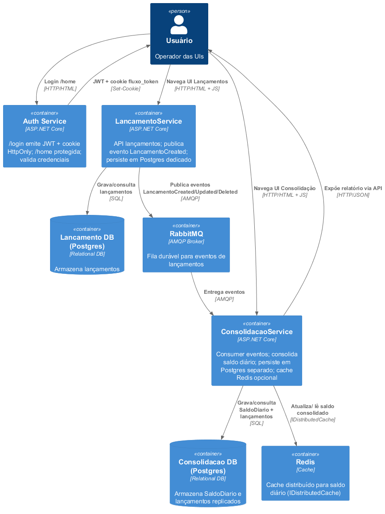

### Contexto

## Containers (do README)

## Estrutura de Eventos (do README)
- Evento publicado: `LancamentoCreated` (extensível para Updated/Deleted)
- Exchange: `lancamentos` (fanout)
- Fila consumer: `lancamentos_consolidacao`

## Modelo de Dados Essencial (do README)
`Lancamento`: Id, FluxoDeCaixaId, Valor, Tipo (0 crédito / 1 débito), Data (UTC), Descricao
`SaldoDiario`: Data (PK), SaldoTotal
