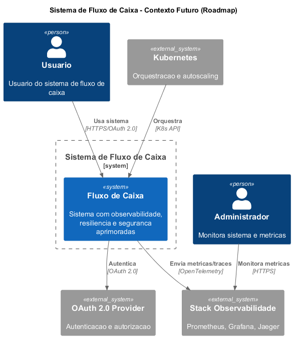

# Roadmap e Melhorias Futuras

Planejamento de evolução da solução com melhorias técnicas e funcionais prioritárias.

## Melhorias Planejadas

### 🔍 Observabilidade
- **Tracing distribuído** com OpenTelemetry e Jaeger
- **Métricas avançadas** com Prometheus e Grafana
- **Health checks** para dependências (DB, RabbitMQ, Redis)

### 🛡️ Resiliência
- **Circuit breakers** com Polly para retry policies
- **Cache inteligente** com Redis para consultas frequentes
- **Connection pooling** otimizado para alta performance

### 🔒 Segurança
- **JWT com refresh tokens** e OAuth 2.0
- **Rate limiting** por usuário e endpoint
- **Audit logs** para operações críticas
- **Encryption at rest** para dados sensíveis

### ☁️ Produção
- **Deploy Kubernetes** com Helm charts e autoscaling
- **CI/CD pipeline** com GitHub Actions
- **Multi-região** com replicação de dados

## Diagrama C4 - Contexto Futuro

